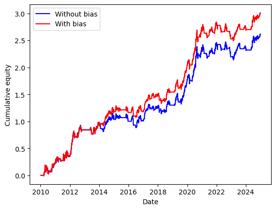
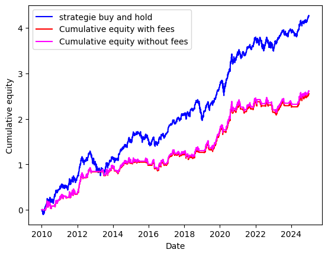
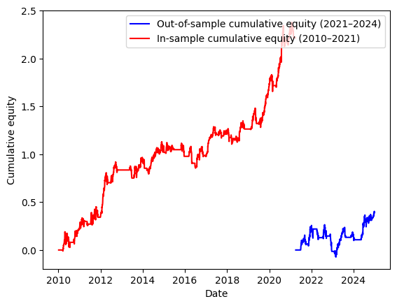

# Backtesting Engine

> *"A vectorized backtesting engine built to expose — and avoid — the classic biases: look-ahead bias, survivorship bias, and ignored transaction costs. Demonstrated on a MA crossover strategy that I show honestly does not survive real costs."*

This engine demonstrates how easy it is to introduce bias in a strategy evaluation. We quantify look-ahead bias, compare performance before and after transaction costs, and validate out-of-sample — showing that honest results matter more than impressive Sharpe ratios.

---

## 1. Look-Ahead Bias

A signal calculated at time `t` cannot be used to trade at time `t` — you only have the data at market close, and the next trade is at the next open. The correct implementation uses `.shift(1)` on the signal.

| | Sharpe |
|---|---|
| Without look-ahead bias (correct) | 0.87 |
| With look-ahead bias (wrong) | 1.00 |

The gap (+15%) is the illusion of alpha that disappears once the implementation is corrected.

---

## 2. Transaction Costs & Buy-and-Hold

Running the MA crossover strategy with realistic costs (5 bps fees + 2 bps slippage per trade):

| | Sharpe | Final cumulative equity |
|---|---|---|
| Buy-and-hold | — | ~4.3 |
| MA crossover (no costs) | 0.87 | ~2.6 |
| MA crossover (with costs) | 0.85 | ~2.3 |

**Verdict:** The strategy does not beat buy-and-hold, before or after costs. The low turnover means costs are not the main issue — the strategy simply does not generate enough alpha.

---

## 3. Out-of-Sample Validation

Data split chronologically: 75% in-sample (2010–2021), 25% out-of-sample (2021–2024). No random split — future data must never contaminate past calibration.

| | Sharpe |
|---|---|
| In-sample (2010–2021) | 0.87 |
| Out-of-sample (2021–2024) | 0.59 |

The drop from 0.87 to 0.59 confirms that the MA crossover overfits to the bull market regime of 2010–2021 and fails to generalize to the more volatile 2021–2024 period.

---

## 4. Known Limitations

- **Survivorship bias:** Yahoo Finance only provides data for currently listed tickers. A strategy tested on a universe of stocks would overestimate performance by excluding delisted or bankrupt companies. This bias is not corrected here but is acknowledged.
- **Single asset:** results are specific to AAPL over 2010–2024 and may not generalize.
- **Strategy simplicity:** MA crossover is a naive baseline, not a production strategy.

---

## 5. How to Reuse This Engine

The engine is modular. To plug in a new strategy:

1. Write a function in `src/strategy.py` that takes a price Series and returns a position Series (already `.shift(1)`-ed inside the strategy).
2. Pass the positions to `engine(positions, prices, fees_bps, slippage_bps)`.
3. Use `src/metrics.py` for Sharpe, max drawdown, and turnover.
4. Use `src/validation.py` to split data chronologically before evaluating.

Projects 03 (stat arb / cointegration) and 05 (LLM signal validation) plug directly into this interface.
